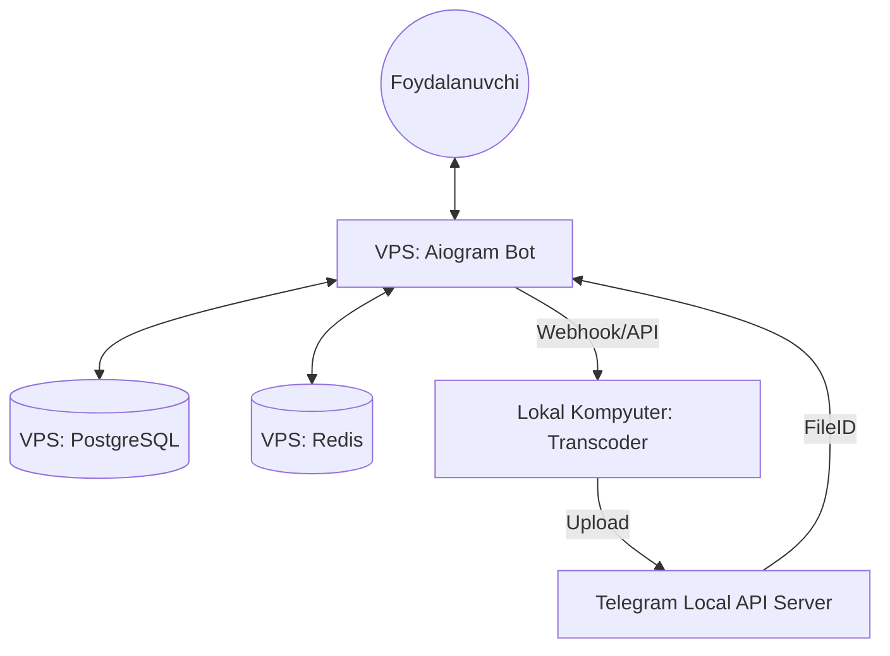

# 🎬 Movie Bot - Advanced Telegram Movie System

Professional darajadagi filmlar va epizodli filmlar (mini-series) bot tizimi. Bu tizim yuqori yuklamali video qayta ishlash jarayonlarini optimallashtirish uchun **VPS + Lokal Worker** arxitekturasidan foydalanadi.

---

## 🔥 Asosiy Imkoniyatlar

- **Dual-Server Arxitekturasi**: Bot va ma'lumotlar bazasi VPSda ishlaydi, og'ir video transkodlash (FFmpeg) esa Lokal kompyuterda (Worker) amalga oshiriladi.
- **Darajali Admin Tizimi (RBAC)**:
  - **Level 1 (Admin)**: Kontent qo'shish, statistika va tahrirlash.
  - **Level 2 (Super Admin)**: Adminlarni boshqarish (qo'shish/o'chirish/daraja o'zgartirish).
- **Multilanguage (i18n)**: To'liq O'zbek va Rus tillari qo'llab-quvvatlanadi.
- **Video Transcoding**: Videolarni turli sifatlarda (360p, 480p, 720p) avtomatik qayta ishlash.
- **Webhook & Polling**: VPSda Webhook, lokal testlarda Polling rejimlari.
- **Telegram Local API**: Katta hajmli fayllar bilan ishlash uchun xususiy Telegram API server integratsiyasi.

---

## 🏗 Arxitektura Chizmasi



---

## ⚙️ Sozlash (Installation)

### 1. VPS Tomoni (Bot)
1. `.env` faylini namunadagidek (`.env.example`) to'ldiring:
   - `USE_WEBHOOK=True`
   - `WEBHOOK_URL=https://sizning_domeningiz.com`
2. Docker orqali ishga tushiring:
   ```bash
   docker-compose up --build -d
   ```

### 2. Lokal Kompyuter Tomoni (Worker)
1. Worker kodini yuklang va muhitni sozlang.
2. FFmpeg o'rnatilganligiga ishonch hosil qiling.
3. Worker'ni API serverga ulab ishga tushiring.

---

## 🛡 Admin Darajalari

| Huquqlar | Level 1 | Level 2 |
| :--- | :---: | :---: |
| Kinolar qo'shish | ✅ | ✅ |
| Epizodli filmlarni boshqarish | ✅ | ✅ |
| Statistikani ko'rish | ✅ | ✅ |
| Admin qo'shish/o'chirish | ❌ | ✅ |
| Admin darajasini o'zgartirish | ❌ | ✅ |

> [!IMPORTANT]
> `.env` faylidagi `ADMINS_IDS` ro'yxatidagi adminlar har doim "Root Super Admin" huquqiga ega bo'ladilar.

---

## 🌍 Multilanguage (Tarjimalar)

Tarjimalarni yangilash uchun quyidagi buyruqlardan foydalaning:

1. Matnlarni ajratib olish:
   ```bash
   pybabel extract -F babel.cfg -o translations/messages.pot .
   ```
2. Tarjima fayllarini yangilash:
   ```bash
   pybabel update -i translations/messages.pot -d translations
   ```
3. Kompilyatsiya qilish:
   ```bash
   pybabel compile -d translations
   ```

---

## 🛠 Texnologiyalar

- **Framework**: Aiogram 3.x
- **Dialogs**: aiogram-dialog
- **Database**: PostgreSQL (SQLAlchemy + Asyncpg)
- **Caching**: Redis
- **Container**: Docker & Docker Compose
- **Video**: FFmpeg
- **Language**: Python 3.12+
