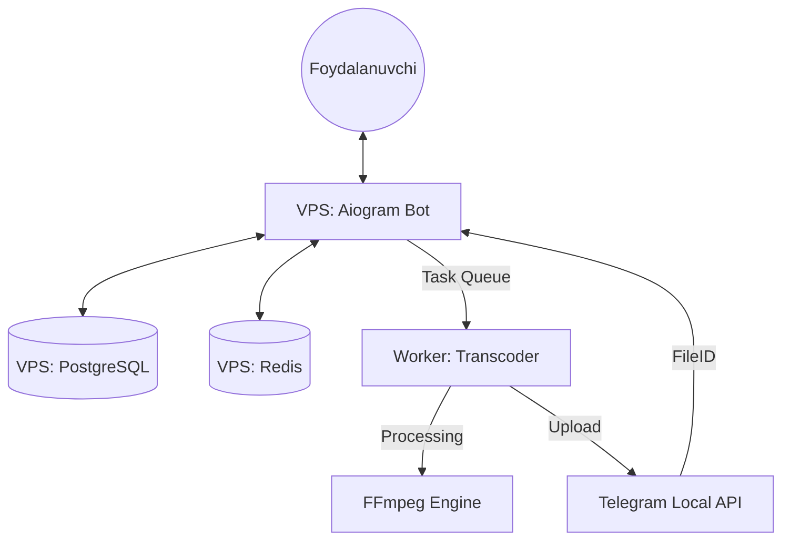

# 🎬 Movie Bot - Advanced Telegram Movie System

Professional darajadagi filmlar va seriyallar uchun Telegram bot tizimi. Bu tizim yuqori yuklamali video jarayonlarni optimallashtirish uchun **VPS + Local Path** arxitekturasidan foydalanadi.

---

## 🔥 Asosiy Imkoniyatlar

- **Dual-Server Arxitekturasi**: Bot va DB VPSda, og'ir video transkodlash (FFmpeg) esa lokal serverda (Worker).
- **Darajali Admin Tizimi (RBAC)**:
  - **Super Admin**: Barcha huquqlar, adminlarni boshqarish.
  - **Admin**: Kontent qo'shish va tahrirlash.
- **Multilanguage (i18n)**: To'liq O'zbek, Rus va Ingliz tillari qo'llab-quvvatlanadi.
- **Video Transcoding**: Videolarni turli sifatlarda (360p, 480p, 720p) FFmpeg orqali avtomatik qayta ishlash.
- **To'lov Tizimlari**: Payme va Click integratsiyasi.
- **Telegram Local API**: Katta hajmli fayllarni (2GB+) tezroq yuklash uchun integratsiya.

---

## 🛠 Texnologiyalar

- **Language**: Python 3.13+
- **Framework**: [Aiogram 3.x](https://github.com/aiogram/aiogram)
- **UI**: [Aiogram-dialog](https://github.com/Tishka17/aiogram_dialog)
- **Database**: PostgreSQL + SQLAlchemy (Async)
- **Caching/Queue**: Redis
- **Background Tasks**: Celery
- **Video Processing**: FFmpeg
- **Package Manager**: [UV](https://github.com/astral-sh/uv)

---

## 🏗 Arxitektura



---

## ⚙️ O'rnatish (Installation)

### 1. Muhitni sozlash
Loyihani klon qiling va `uv` orqali muhitni yarating:
```bash
git clone https://github.com/coder-jasur/Movie-Bot.git
cd Movie-Bot
uv venv
uv sync
```

### 2. Konfiguratsiya
`.env` faylini namunadagidek yarating:
```bash
cp .env.example .env
```
Faylni ochib, quyidagi asosiy o'zgaruvchilarni to'ldiring:
- `BOT_TOKEN`
- `ADMINS_IDS`
- `DATABASE_URL`
- `REDIS_URL`

### 3. Ishga tushirish (Docker)

Loyihada bot va worker xizmatlari alohida ajratilgan (asosiy server yuklamasini kamaytirish maqsadida):
- **Bot (`Dockerfile`)**: Yengil variant (FFmpeg o'rnatilmaydi).
- **Worker (`worker.Dockerfile`)**: Celery worker va FFmpeg mavjud.

Barcha xizmatlarni (bot + worker + db + redis) bir vaqtda ishga tushirish uchun:
```bash
docker-compose up --build -d
```

> **Eslatma:** Agar siz loyihani asosiy VPS da ko'tarayotgan bo'lsangiz va worker boshqa qurilmada (Local) bo'lsa, docker-compose dan worker qismini o'chirib qo'yishingiz mumkin.

---

## 🌍 Tarjimalar (i18n)

Tarjimalarni yangilash uchun:
1. Matnlarni yig'ish: `pybabel extract -F babel.cfg -o translations/messages.pot .`
2. Fayllarni yangilash: `pybabel update -i translations/messages.pot -d translations`
3. Kompilyatsiya: `pybabel compile -d translations`

---

## 🛡 Xavfsizlik va Litsenziya

- Loyiha xavfsizligi uchun `.env` fayllari gitga yuklanmasligi shart.
- Barcha maxfiy ma'lumotlar faqat server muhitida saqlanishi tavsiya etiladi.

Litsenziya: **MIT**
Muallif: **Coder Jasur**
